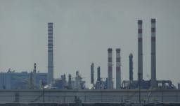

### sightseeing again

```
OSINT
There is something in the bz2 file. We can't open it. We only know that there are four big things with red and white color on the right. Locate the things and tell us the local part of the plus code.

Flag format: local-part-of-the-plus-code. The flag is just the local part. No syskronCTF{} this time! And, of course, no brute forcing!
```

first thing I did after downloading the bz2 file was try to extract it

`bzip2 -dk 12284592390060427.bz2`

but it failed...

`bzip2: 12284592390060427.bz2 is not a bzip2 file.`

running file I see..

`12284592390060427.bz2: bzip2 compressed data`

what's going on?

after trying a different unzipper it seems the archive is password protected,

using binwalk though I was able to extract some files

`binwalk --dd='.*' 12284592390060427.bz2`


running strings on the TIFF


```text
SONY
ILCE-7M3
2020:06:21 11:12:59
0231
2020:06:21 11:12:59
2020:06:21 11:12:59
+02:00
+02:00
+02:00
FE 70-300mm F4.5-5.6 G OSS
JFIF
 $.' ",#
(7),01444
'9=82<.342

(http://ns.adobe.com/xap/1.0/
<?xpacket begin='
' id='W5M0MpCehiHzreSzNTczkc9d'?>
<x:xmpmeta xmlns:x='adobe:ns:meta/' x:xmptk='Image::ExifTool 10.40'>
<rdf:RDF xmlns:rdf='http://www.w3.org/1999/02/22-rdf-syntax-ns#'>
 <rdf:Description rdf:about=''
  xmlns:GPano='http://ns.google.com/photos/1.0/panorama/'>
  <GPano:FirstPhotoDate>2020-07-06</GPano:FirstPhotoDate>
 </rdf:Description>
</rdf:RDF>
</x:xmpmeta>
```

using exiftool we get much more useful information, including a Latitude 

```
ExifTool Version Number         : 12.08
File Name                       : 1E.tiff
Directory                       : .
File Size                       : 2.4 MB
File Modification Date/Time     : 2020:10:22 19:20:06+01:00
File Access Date/Time           : 2020:10:22 19:24:04+01:00
File Inode Change Date/Time     : 2020:10:22 19:23:55+01:00
File Permissions                : rw-r--r--
File Type                       : TIFF
File Type Extension             : tif
MIME Type                       : image/tiff
Exif Byte Order                 : Little-endian (Intel, II)
Compression                     : JPEG
Make                            : SONY
Camera Model Name               : ILCE-7M3
X Resolution                    : 240
Y Resolution                    : 240
Resolution Unit                 : inches
Modify Date                     : 2020:06:21 11:12:59
Exposure Time                   : 1/25
F Number                        : 10.0
Exposure Program                : Aperture-priority AE
ISO                             : 100
Sensitivity Type                : Recommended Exposure Index
Recommended Exposure Index      : 100
Exif Version                    : 0231
Date/Time Original              : 2020:06:21 11:12:59
Create Date                     : 2020:06:21 11:12:59
Offset Time                     : +02:00
Offset Time Original            : +02:00
Offset Time Digitized           : +02:00
Shutter Speed Value             : 1/25
Aperture Value                  : 10.0
Brightness Value                : 4.775
Exposure Compensation           : -2.7
Max Aperture Value              : 5.0
Metering Mode                   : Multi-segment
Light Source                    : Unknown
Flash                           : Off, Did not fire
Focal Length                    : 109.0 mm
Sub Sec Time Original           : 1
Sub Sec Time Digitized          : 1
Color Space                     : sRGB
Focal Plane X Resolution        : 1677.417969
Focal Plane Y Resolution        : 1677.417969
Focal Plane Resolution Unit     : cm
File Source                     : Digital Camera
Scene Type                      : Directly photographed
Custom Rendered                 : Normal
Exposure Mode                   : Auto bracket
White Balance                   : Auto
Digital Zoom Ratio              : 1
Focal Length In 35mm Format     : 109 mm
Scene Capture Type              : Standard
Contrast                        : Normal
Saturation                      : Normal
Sharpness                       : Normal
Lens Info                       : 70-300mm f/4.5-5.6
Lens Model                      : FE 70-300mm F4.5-5.6 G OSS
GPS Version ID                  : 2.2.0.0
GPS Latitude Ref                : North
GPS Speed Ref                   : km/h
GPS Speed                       : 79
Image Width                     : 256
Image Height                    : 152
Bits Per Sample                 : 8 8 8
Photometric Interpretation      : YCbCr
Samples Per Pixel               : 3
Thumbnail Offset                : 1118
Thumbnail Length                : 4424
Aperture                        : 10.0
Image Size                      : 256x152
Lens ID                         : FE 70-300mm F4.5-5.6 G OSS
Megapixels                      : 0.039
Scale Factor To 35 mm Equivalent: 1.0
Shutter Speed                   : 1/25
Create Date                     : 2020:06:21 11:12:59.1+02:00
Date/Time Original              : 2020:06:21 11:12:59.1+02:00
Modify Date                     : 2020:06:21 11:12:59+02:00
Thumbnail Image                 : (Binary data 4424 bytes, use -b option to extract)
GPS Latitude                    : 45.461892 N
Circle Of Confusion             : 0.030 mm
Field Of View                   : 18.8 deg
Focal Length                    : 109.0 mm (35 mm equivalent: 109.0 mm)
Hyperfocal Distance             : 39.54 m
Light Value                     : 11.3
```

key info here is 
```
Create Date          : 2020:06:21 11:12:59.1+02:00
GPS Latitude         : 45.461892 N
```

From the date and timezone we know it must be a country that is UTC+2 during summer months.
From the latitude we know it must also lie on the 45th parallel.
The two main countries fitting this are Italy and France.

I looked into Italy first. I took note that Venice seems to lie roughly on the latitude needed

Based on the picture:



I started looking into oil refineries.
I looked into all oil refineries into Italy, [here](https://en.wikipedia.org/wiki/List_of_oil_refineries#Italy) and [here](https://www.refinerymaps.com/Italy.html)

Hmmm there is an oil refinery in Venice, lets google and see, [Bingo!](https://duckduckgo.com/?q=%22Porto+Marghera%22+%22Venice%22&t=brave&iar=images&iax=images&ia=images&iai=http%3A%2F%2Fstatic.panoramio.com%2Fphotos%2Flarge%2F13650249.jpg)
It's a different perspective, but definitely the same towers.

I found [another view](https://www.google.com/maps/@45.42,12.2591667,3a,24.2y,44.95h,88.8t/data=!3m8!1e1!3m6!1sAF1QipMUz7hPGN41znh7TbuelaSDkajamR5XN01kAUWx!2e10!3e11!6shttps:%2F%2Flh5.googleusercontent.com%2Fp%2FAF1QipMUz7hPGN41znh7TbuelaSDkajamR5XN01kAUWx%3Dw203-h100-k-no-pi-10-ya326.2857-ro-0-fo100!7i8192!8i4096?hl=en) on google maps.

Now I need the [Open Location Code](https://en.wikipedia.org/wiki/Open_Location_Code) of the towers. I used Google Earth to get the exact Longitude and Latitude coordinates of the towers [here](https://earth.google.com/web/@45.43833386,12.25445367,14.54207167a,351.04989d,35y,-143.21609481h,60.00096496t,0r)

and settled on 
```
latitude: 45.43833386
longitude: 12.25445367
```

and used an online tool to convert these to Open Location Code, [here](https://www.dcode.fr/open-location-code)

which gave me: `8FQJC7Q3+CH`

Now from the description I know I need only the local part, I figured out that is the last 6 digits from [this](https://towardsdatascience.com/plus-codes-open-location-code-and-scripting-in-google-bigquery-30b7278f3495) article

trying `C7Q3+CH` I got incorrect hmmm, reading further in the article I realised the last two digits do not convey any information, so I tried `C7Q3`
and this was correct!

flag is `C7Q3` __no syskronCTF{} is needed!__